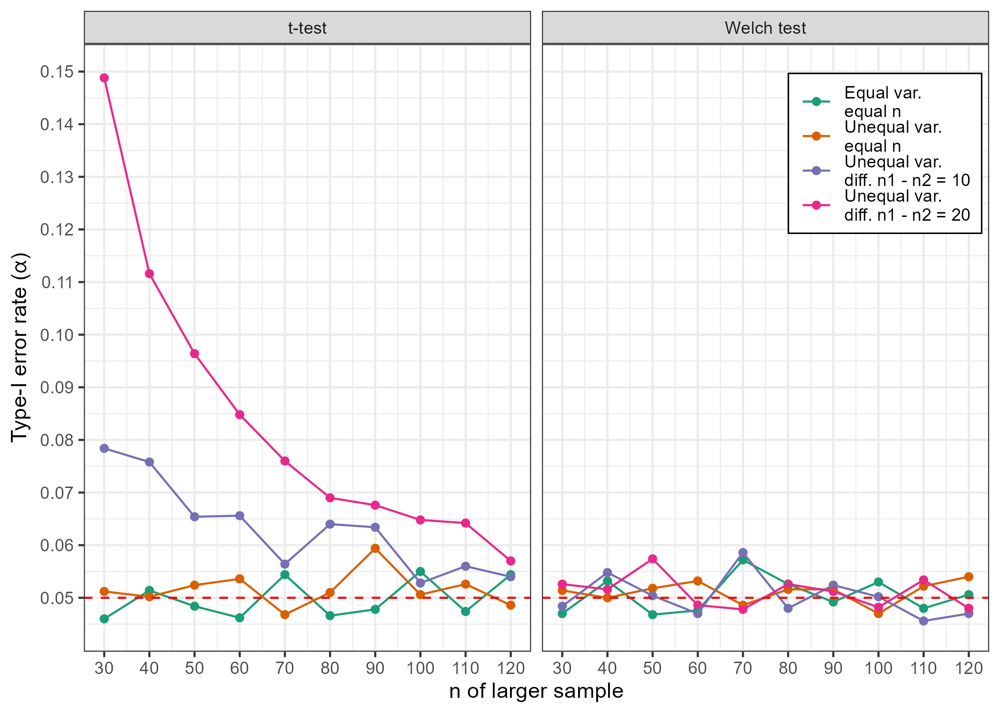

# The impact of assumption violations on test results {#sec-a2tests}

Although we have discussed checking for bias in our models, you will likely have noticed that assumption tests are very rarely reported in the psychological literature, which could lead you to question the influence that assumption violations have on inference.   

Normally, we do not know whether $H_0$ or $H_1$ is true, but simulations allow us to fix "population" parameters and then draw samples to investigate how robust our hypothesis tests are against assumption violations. For example, in the case of an independent samples t-test we can look at the long-run type-I error rate ($\alpha$) of the test by repeatedly drawing samples from a simulated population where the true mean difference - $\mu_{group 1}$ - $\mu_{group 1}$ - is equal to 0 and calculating the proportion of significant test results. Simulating in this way under conditions where test assumptions are met and comparing the results with simulations generated in the presence of assumption violations can give us information on the impact of these violations. 

## Homogeneity of variances

Although Field [@field2025] discusses how violations of the assumption of normality may have only trivial impacts in large enough samples, he also mentions problems associated with heteroscedasticity, particularly when group sizes differ. To highlight this, I present results from simulations where, on each simulation iteration, I drew two virtual groups of participants from a normal distribution with $\mu$ = 0 under four conditions:

1. Equal variances and sample sizes: $\sigma$ = 1
2. Unequal variances and equal sample sizes: $\sigma$ group 1 = 1, $\sigma$ group 2 = 2
3. Unequal variances and unequal sample sizes: $\sigma$ group 1 = 1, $\sigma$ group 2 = 2; difference between $n$ group 1 and $n$ group 2 = 10
4. Unequal variances and unequal sample sizes: $\sigma$ group 1 = 1, $\sigma$ group 2 = 2; difference between $n$ group 1 and $n$ group 2 = 20

In each of these four conditions, I iterated through sample sizes from $n$ group 1 = 30 - $n$ group 1 = 120, in steps of 10. For each of these sample size iterations, I ran 5,000 independent-samples t-tests and 5,000 Welch tests for each of the conditions presented above and saved the proportion of significant test results, assuming the typical $\alpha$ = .05. The results are shown below.

```{r}

# library(dplyr)
# library(ggplot2)
# library(tibble)

# 
# ## Data generating process
# ## Adapted from: https://github.com/lmu-osc/Introduction-Simulations-in-R/blob/main/exercise_script_with_solutions.R
# 
# simT <- function(n1, n2, m1, m2, sd1, sd2){
#   x1 <- rnorm(n1,m1,sd1)
#   x2 <- rnorm(n2,m2,sd2)
#   t.test(x1, x2, var.equal = TRUE)$p.value # assume equal variances
# }
# 
# simWelch <- function(n1, n2, m1, m2, sd1, sd2){
#   x1 <- rnorm(n1,m1,sd1)
#   x2 <- rnorm(n2,m2,sd2)
#   t.test(x1, x2, var.equal = FALSE)$p.value # Welch test
# }

# 
# set.seed(282061222)
# 
# nit<-5000

# n1<-seq(30,120,10)
# n2<-seq(20,110,10)
# n3<-seq(10,100,10)
# 
# eqres<-numeric(length(n1))
# uneqres<-numeric(length(n1))
# uneqsampres<-numeric(length(n1))
# hiuneqsampres<-numeric(length(n1))
# ########
# welch.eqres<-numeric(length(n1))
# welch.uneqres<-numeric(length(n1))
# welch.uneqsampres<-numeric(length(n1))
# welch.hiuneqsampres<-numeric(length(n1))
# 
# 
# for(i in 1:length(n1)){
#   eqres[i]<-mean(replicate(nit, simT(n1[i],n1[i],0,0,1,1))<=.05) # equal var
#   uneqres[i]<-mean(replicate(nit, simT(n1[i],n1[i],0,0,1,2))<=.05) # unequal var
#   uneqsampres[i]<-mean(replicate(nit, simT(n1[i],n2[i],0,0,1,2))<=.05) # unequal var and sample size
#   hiuneqsampres[i]<-mean(replicate(nit, simT(n1[i],n3[i],0,0,1,2))<=.05) # unequal var and sample size
#   #########
#   welch.eqres[i]<-mean(replicate(nit, simWelch(n1[i],n1[i],0,0,1,1))<=.05) # equal var
#   welch.uneqres[i]<-mean(replicate(nit, simWelch(n1[i],n1[i],0,0,1,2))<=.05) # unequal var
#   welch.uneqsampres[i]<-mean(replicate(nit, simWelch(n1[i],n2[i],0,0,1,2))<=.05) # unequal var and sample size
#   welch.hiuneqsampres[i]<-mean(replicate(nit, simWelch(n1[i],n3[i],0,0,1,2))<=.05) # unequal var and sample size
# }
# 
# simdat<-tibble::tibble(
#   sizenone=rep(seq(30,120,10),8),
#   sim=rep(c(rep("Equal var.\nequal n",length(n1)),
#         rep("Unequal var.\nequal n",length(n1)),
#         rep("Unequal var.\ndiff. n1 - n2 = 10",length(n1)),
#         rep("Unequal var.\ndiff. n1 - n2 = 20",length(n1))),2),
#   res=c(eqres,uneqres,uneqsampres,hiuneqsampres,
#         welch.eqres,welch.uneqres,welch.uneqsampres,welch.hiuneqsampres),
#   test=rep(c("t-test","Welch test"),each = length(n1)*4)
#   )
# 
# simdat$sim<-factor(simdat$sim,c("Equal var.\nequal n","Unequal var.\nequal n",
#                          "Unequal var.\ndiff. n1 - n2 = 10",
#                          "Unequal var.\ndiff. n1 - n2 = 20"))
# 
# saveRDS(simdat, "./data/simdata_a2_var.rds")
# 
# simdat<-readRDS("./data/simdata_a2_var.rds")
# 
# plot<-ggplot2::ggplot(data=simdat,ggplot2::aes(x = sizenone, y = res,
#                                           group = sim, color = sim)) +
#   ggplot2::theme_bw() +
#   ggplot2::geom_point() +
#   ggplot2::geom_line() +
#   ggplot2::facet_wrap(facets = ggplot2::vars(test)) +
#   ggplot2::labs(y = expression(paste("Type-I error rate (", alpha, ")")), x = "n of larger sample") +
#   ggplot2::scale_y_continuous(limits = c(.045,.15),
#                               breaks = seq(.05, .15, .01))+
#   ggplot2::scale_x_continuous(limits = c(30,120),
#                               breaks = seq(30, 120, 10))+
#   ggplot2::geom_hline(yintercept = .05, linetype = "dashed",color = "red") +
#   ggplot2::theme(legend.title=ggplot2::element_blank(),
#                  legend.position=c(.885,.82),
#                  legend.background = ggplot2::element_blank(),
#                  legend.box.background = ggplot2::element_rect(colour = "black")) +
#   ggplot2::scale_color_brewer(palette = "Dark2")
# 
# ggplot2::ggsave("./images/simdata_var_type1.png",plot)

```

{width=75% fig-align='center'}  
  
  We can see that the conventional independent-samples t-tests fare well when sample sizes are equal, but we see type-I error rates in excess of .05 when both variances and sample sizes are unequal across groups, particularly in smaller samples. In contrast, the Welch test (which does not assume equal variances) appears robust to sample size and variance inequalities, returning 5% false-positives under all conditions. 

## Conclusion

Hopefully this limited demonstration illustrates some of the problems that can arise from violations of testing assumptions. In situations where homogeneity of variances cannot be confirmed, it would be wise to use alternatives like the Welch adjustments for independent-samples t-tests and one-way ANOVA.
