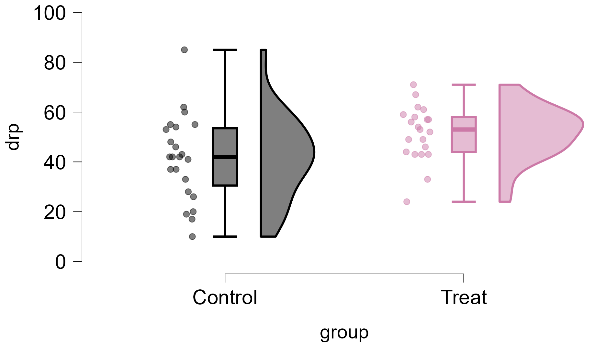

## Welcome!

### Our agenda for today:

-   Course structure, assessment and questions
-   Forming your assignment pairs
-   Install and start up JASP
-   Learn how to wrangle and visualize data

## Course structure and assessment {.smaller}

-   15 lectures
    -   9 on statistics, 6 on Critical Thinking
    -   1 exam for statistics (March 5th) and 1 for Critical Thinking (March 27th)
-   11 tutorials
    -   8 on statistics, 3 on critically analyzing research papers (preparation for second exam)
    -   7 graded JASP assignments completed in pairs in tutorials 2 - 8
        -   30% of your grade formed from your best 5 assignments
        -   Watch tutorial videos **before** coming to class!!

. . .

**Questions?**

## In-class assignments

-   Class begins with 5-10 minutes for questions on recent videos/techniques
-   Assignments are then completed in class and submitted by 15:15 on Wednesdays (due to the Emotions lecure directly following the tutorial), or 13:15 on Fridays
-   All material available on the tutorial guide
-   Assignments submitted via canvas

## Form your assignment pairs!

## JASP {.smaller}

{.absolute .fragment top="100" right="40" width="35%"}

-   Have you installed it and taken a look?
-   A lot like SPSS, but...
    -   Free!!
    -   *Much* nicer figures

. . .

{width="50%"}

## Wrangling and visualizing data with JASP {.smaller}

{.absolute .fragment top="100" right="40" width="35%"}

::: {.column width="50%"}
-   We will work through steps together with data available in the tutorial manual
    -   https://dvlaming.github.io/SRMP/t1.html
    -   Chapter link also available on Canvas
:::

::: notes
Move to demo now with JASP using reduced ESS11 dataset.

We cover: 

- Filtering (selecting cases) + Manual filter and R code  
- Computing new variables   
    + compute average of the three 11 point immigration variables using R - Creating new recoded/relabelled variables     
    + ifelse in r - use one of the 4-point immigration variables to create 'anti' and 'pro' groups + ifelse(imsmetn\<=2, "pro", "anti")     
- Generating descriptives and frequencies   
- Boxplots   
- Scatterplots    
    + also split by groups    
- Raincloud plots  

:::
