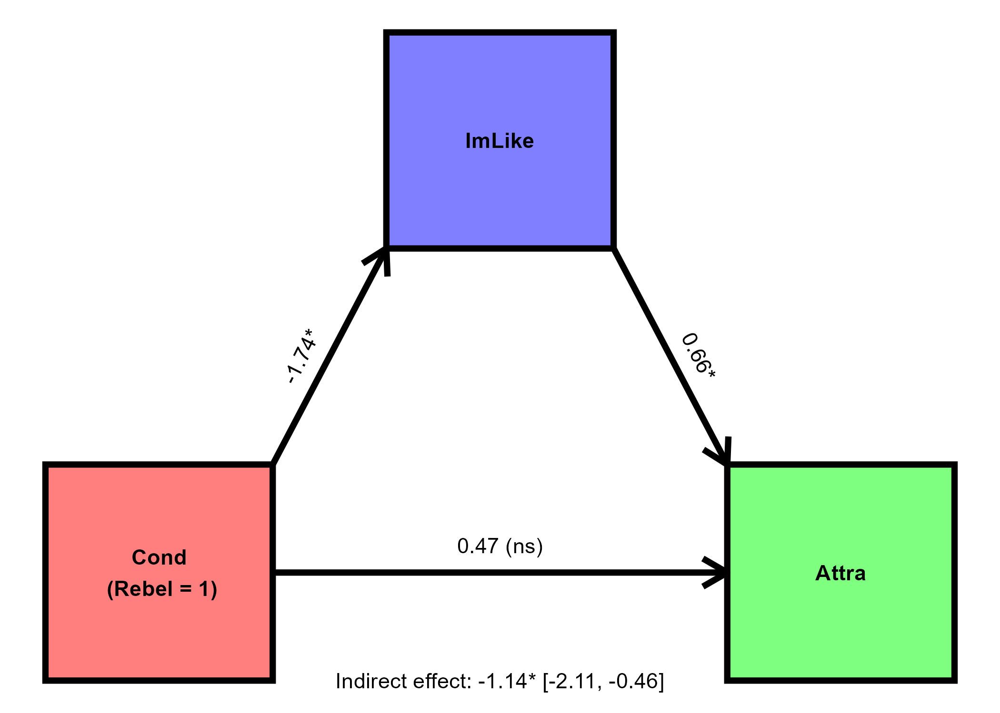

```{r DataAndPackageImport, echo = FALSE, warning = FALSE, message = FALSE}

library(dplyr)
library(tidyr)
library(haven)
library(broom)
library(ggplot2)
# library(QuantPsyc) ##standardized coefficients
## https://stackoverflow.com/questions/24305271/extracting-standardized-coefficients-from-lm-in-r
## https://cran.r-project.org/web/packages/ggdag/vignettes/intro-to-dags.html
## https://r-causal.github.io/ggdag/

#read
ESSDat<-haven::read_sav("Week6assignment_pt1.sav")

#drop missing and centre predictors

ESSDat<-ESSDat %>% 
  filter(inprdsc<=6 & agea!=999 & stflife<=10) %>% 
  mutate(ageaMeanCent=agea-mean(agea)) %>% 
  mutate(inprdscMeanCent=inprdsc-mean(inprdsc)) %>% 
  mutate(agea1SDAbCent=ageaMeanCent-sd(agea)) %>% #mod 1sd above
  mutate(agea1SDBeCent=ageaMeanCent+sd(agea)) %>%  #mod 1sd below
  mutate(ageaStandard=(agea-mean(agea))/sd(agea)) %>% 
  mutate(inprdscStandard=(inprdsc-mean(inprdsc))/sd(inprdsc)) %>% 
  mutate(agea1StandardSDAbCent=ageaStandard-1) %>% #mod 1sd above
  mutate(agea1StandardSDBeCent=ageaStandard+1) %>%   #mod 1sd below
  mutate(stflifeStandard=(stflife-mean(stflife)/sd(stflife)))


Model1<-lm(stflife~inprdscMeanCent*ageaMeanCent,data=ESSDat)
Model1Tab<-broom::tidy(Model1,conf.int = T)
names(Model1Tab)<-c("Term","b","SE","t","p","CIlo","CIhi")
Model1Tab<-Model1Tab %>% 
  mutate(p=replace(p,p<.001,"<.001"))
Model1Tidy<-knitr::kable(Model1Tab,align=('ccccccc'),digits=4)

UncentModel<-lm(stflife~inprdsc*agea,data=ESSDat)
UncentModelTab<-broom::tidy(UncentModel,conf.int = T)
names(UncentModelTab)<-c("Term","b","SE","t","p","CIlo","CIhi")
UncentModelTab<-UncentModelTab %>% 
  mutate(p=replace(p,p<.001,"<.001"))
UncentModelTidy<-knitr::kable(UncentModelTab,align=('ccccccc'),digits=4)

Model2<-lm(stflife~inprdscMeanCent*agea1SDAbCent,data=ESSDat)
Model2Tab<-broom::tidy(Model2)
names(Model2Tab)<-c("Term","b","SE","t","p","CIlo","CIhi")
Model2Tab<-Model2Tab %>% 
  mutate(p=replace(p,p<.001,"<.001"))
Model2Tidy<-knitr::kable(Model2Tab,align=('ccccccc'))


Model3<-lm(stflife~inprdscMeanCent*agea1SDBeCent,data=ESSDat)
Model3Tab<-broom::tidy(Model3)
names(Model3Tab)<-c("Term","b","SE","t","p","CIlo","CIhi")
Model3Tab<-Model3Tab %>% 
  mutate(p=replace(p,p<.001,"<.001"))
Model3Tidy<-knitr::kable(Model3Tab,align=('ccccccc'))

##### Standardized Coeffs
Model1Stan<-lm(stflifeStandard~inprdscStandard*ageaStandard,data=ESSDat)
Model1StanTab<-broom::tidy(Model1Stan,conf.int = T)
names(Model1StanTab)<-c("Term","b","SE","t","p","CIlo","CIhi")
Model1StanTidy<-knitr::kable(Model1StanTab,align=('ccccccc'))

Model2Stan<-lm(stflifeStandard~inprdscStandard*agea1StandardSDAbCent,data=ESSDat)
Model2StanTab<-broom::tidy(Model2Stan)

Model3Stan<-lm(stflifeStandard~inprdscStandard*agea1StandardSDBeCent,data=ESSDat)
Model3StanTab<-broom::tidy(Model3Stan)
```


## Part 1/2 (SPSS)

The datafile **Assignment7_data_part1** contains a reduced version of the data from wave 10 of the ESS prepared by Prof. Vriends, a researcher who hypothesizes that the number of associates/friends a person has with whom they can discuss intimate and personal matters (`inprdsc`) can positively predict their overall satisfaction with life (`stflife`). She also predicts that this effect will be more pronounced among older individuals.

1. State the most appropriate analysis for testing Prof. Vriends' hypotheses. Run this analysis, and paste a **neat** table containing the relevant numerical outputs from JASP into your assignment document. (**3 points**)  <span style="color: red;">
    + Moderation/moderated regression analysis should be performed (1). Answer includes a neat, table of regression coefficients and - at least - p-values (2).</span>
    
```{r}
Model1Tidy
```
<br>
  
2. Interpret **all** findings and comment on their implications for Prof. Vriends' hypotheses. (**9 points**)  <span style="color: red;">  
    + Positive and significant effect of  `inprdsc` (1): those who report having more close contacts report higher levels of satisfaction (1).  
    + Negative and significant effect of `agea` (1): satisfaction decreases as age increases (1).  
    + Significant interaction effect (`inprdsc`*`agea`) (1): the positive effect of `inprdsc` does indeed appear to be more pronounced in older individuals (1), as suggested by the increased slope at higher values of `agea` (1).  
    + Vriends' hypotheses about the effect of `inprdsc` on `stflife` - and how it is moderated by `agea` - seem to be supported (2).</span>  
3. On the basis of Vriends' findings, what life satisfaction score would you predict for someone aged 38 with 2 contacts with whom they can discuss intimate matters? **Show the working for how you arrived at your answer**. (**3 points**)  <span style="color: red;">  
    + Points for correct model equation (1), correct coefficients (1) and correct prediction value (1).
    + Moderated regression equation for only two IVs (i.e., one predictor, one moderator): $\hat{Y}_i=b_0 + b_1A_i + b_2B_i + b_3AB_i$   
    + Three acceptable answers are possible, depending on whether the predictors in the analysis and the scores given in the question are centered or not.  
        + Only analysis predictors centered: $\hat{stflife}=7.1063 + .3207*2 - .0057*38 + .0035*2*38 = 7.7971$    
        + Everything centered: $\hat{stflife}=7.1063 + .3207*-0.5085 - .0057*-12.8839 + .0035*2*38 = 7.2826$  
        + Everything uncentered: $\hat{stflife}=7.0340 + .1446*2 - .0144*38 + .0035*2*38 = 7.042$  

## Part 2/2 (JASP)

The file **Assignment7_data_part2** contains data taken from a study [@monin2008rejection] conducted to test the hypothesis that participants would like (`Attra`) rebels less than obedient people (`Cond`) _and that this difference could be explained by participants imagining that they themselves would be less well-liked (`ImLike`) by rebels than they would be by obedient people_. Participants read the description of a person who either acted as a rebel or as an obedient person and judged how much they thought the described person would like them, and then how much they themselves liked the person described. 

4. Run an appropriate analysis and interpret **all** relevant output with respect to the researchers' hypothesis. (**8 points**)  <span style="color: red;">
    + Condition had a significant and negative effect on imagined liking (1): participants expected to be less liked by the person acting as rebel than by the person acting obediently. (1)
    + Imagined liking significantly and positively predicted linking of the person described (1). The more participants imagined that they would be liked by the person described, the more they seemed to like that person (1).
    + Condition had no significant direct effect on liking when imagined liking was controlled for (1).
    + Condition had a significant, indirect effect on liking (1). Participants liked the described rebellious person less than the obedient person acting obediently and this effect was mediated by whether participants thought that the person described would like them (1).
    + The findings are in line with the researchers' hypothesis of mediation (1). </span>
5. Prepare a diagram to visualize the relationships captured by your model and include this in your assignment document. (**3 points**)  <span style="color: red;">
    + Clear and complete path diagram with correct coefficient values for the paths (3).</span>

```{r}
plot<-ggplot() +
  theme_void() +
  geom_rect(aes(xmin = 1, xmax = 3, ymin = 1, ymax = 3), colour = "black",
            fill = "red", alpha = .5, linewidth = 1.5) +
  geom_rect(aes(xmin = 4, xmax = 6, ymin = 5, ymax = 7), colour = "black",
            fill = "blue", alpha = .5, linewidth = 1.5) +
  geom_rect(aes(xmin = 7, xmax = 9, ymin = 1, ymax = 3), colour = "black",
            fill = "green", alpha = .5, linewidth = 1.5) +
  geom_segment(aes(x = 3, y = 3, xend = 4, yend = 5), linewidth = 1.5,
               arrow = arrow(length = unit(.5,"cm"))) +
  geom_segment(aes(x = 6, y = 5, xend = 7, yend = 3), linewidth = 1.5,
               arrow = arrow(length = unit(.5,"cm"))) +
  geom_segment(aes(x = 3, y = 2, xend = 7, yend = 2), linewidth = 1.5,
               arrow = arrow(length = unit(.5,"cm"))) +
  geom_text(aes(x = 2, y = 2 , label = "Cond\n (Rebel = 1)"), 
            colour = "black", fontface = "bold") +
  geom_text(aes(x = 8, y = 2 , label = "Attra"), colour = "black",
            fontface = "bold") +
  geom_text(aes(x = 5, y = 6 , label = "ImLike"), colour = "black",
            fontface = "bold") +
  geom_text(aes(x = 5, y = 2.25 , label = "0.47 (ns)")) +
  geom_text(aes(x = 3.25, y = 4 , label = "-1.74*"), angle = atan2(2,1) * (180 / pi)) +
  geom_text(aes(x = 6.75, y = 4 , label = "0.66*"), angle = 360 - atan2(2,1) * (180 / pi)) +
  geom_text(aes(x = 5, y = 1 , label = "Indirect effect: -1.14* [-2.11, -0.46]"))

ggsave("SRMP_Assignment7_eigenmeddiag.png",plot)

# {width=50% fig-align='center'}
```

{fig-align='center' width=80%}


## References

