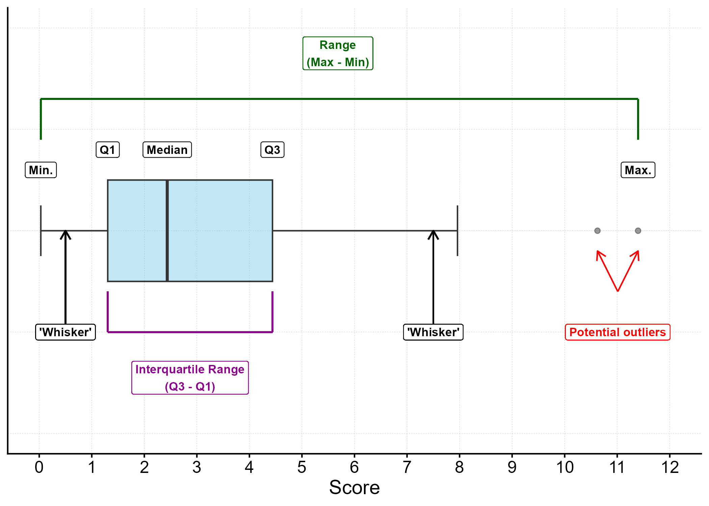
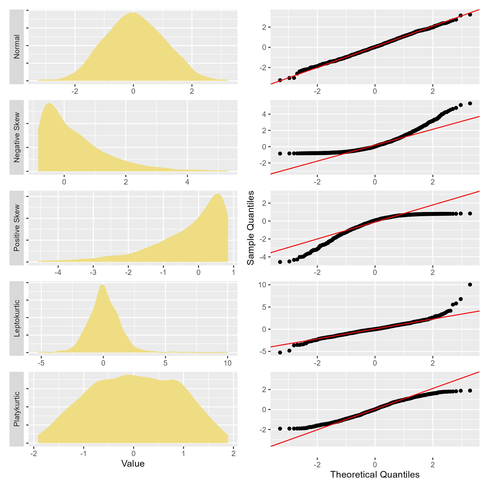

# Bias and checking assumptions {#sec-t2}


## Learning outcomes {#sec-t2ILO}

After viewing the tutorial materials and following along with the demonstration, you can:

1. Screen for outliers using the boxplot rule
2. Check the assumptions of normality and homogeneity of variances, using plots and tests

## Datasets {#sec-t2data}

This demonstration uses the dataset **ReducedESS11** which you can download [here](data/ReducedESS11.jasp). You can see a summary of the variables in the [previous tutorial](t1.qmd#sec-t1data).

## Videos {#sec-t2vid}


<iframe src="https://amsuni-my.sharepoint.com/personal/d_fleming_uva_nl/_layouts/15/embed.aspx?UniqueId=0d85ec35-e5d1-450b-86cd-5e2e728f3e4b&embed=%7B%22ust%22%3Atrue%2C%22hv%22%3A%22CopyEmbedCode%22%7D&referrer=StreamWebApp&referrerScenario=EmbedDialog.Create" width="640" height="360" frameborder="0" scrolling="no" allowfullscreen title="SRMP_2.mp4"></iframe>

## Guide to diagnostic plots {#sec-t2plots}

### Boxplot {#sec-t2box}

```{r}
library(ggplot2)
library(dplyr)
library(tibble)
library(ggtext)

set.seed(282061222)


## split label tekst over meerdere regels: https://stackoverflow.com/questions/73500445/ggplot-insert-linebreak-when-label-is-too-long

datas<-tibble::tibble(x=rchisq(70,3))
x_samenvatting<-summary(datas$x) %>% 
  dplyr::bind_rows() %>%
  tidyr::pivot_longer(cols=everything(), names_to = "soort" ,values_to = "cijfer" ) %>% 
  dplyr::mutate(soort=case_when(soort == "1st Qu." ~ "Q1",
                                soort == "3rd Qu." ~ "Q3",
                                soort == "Median" ~ "Median",
                                .default = soort)) %>% 
  dplyr::mutate(coordy = case_when(soort == "Q1" | soort == "Q3" | 
                                     soort == "Median" ~ .4,
                                   .default = .3)) %>% 
  dplyr::filter(soort!="Mean")

x_IQR<-x_samenvatting$cijfer[4] - x_samenvatting$cijfer[2]

datas<-datas %>% 
  dplyr::mutate(uitschieter=case_when(x > x_samenvatting$cijfer[4] + (1.5 * x_IQR) | 
                                        x < x_samenvatting$cijfer[2] - (1.5 * x_IQR)
                                      ~ "Potential outlier",.default=NA))
uitschieter_datas<-datas %>% 
  dplyr::filter(uitschieter=="Potential outlier") 


puitleg<-ggplot2::ggplot(data=datas,aes(y=x)) +
  theme_classic() +
  theme(panel.grid.major.y = element_line(color = "grey",
                                                  linewidth = .1,
                                          linetype=2),
        panel.grid.major.x = element_line(color = "grey",
                                                  linewidth = .1,
                                          linetype=2)) +
  ggplot2::geom_boxplot(width = 0.5, fill = "skyblue", alpha = 0.5,
                        staplewidth=.5) +
  xlim(-1,1)+
  ggplot2::geom_label(data=x_samenvatting, aes(y=cijfer, x = coordy, label = soort),
                      colour = "black", fontface="bold",
                      size = 3)+
  ggplot2::geom_label(y=mean(uitschieter_datas$x), x = -.5, 
                      label = stringr::str_wrap("Potential outliers",20),
                      colour = "red", fontface="bold",
                      size = 3)+
  ggplot2::geom_segment(data = uitschieter_datas, aes(y = mean(x),
                                                      yend = x, x = -.3, 
                                                      xend = -.1),
                        arrow= arrow(type = "open", length = unit(0.25, "cm")),
                        color="red")+
  ggplot2::geom_segment(y = .5, yend = .5, x = -.5, xend = 0,
                        arrow= arrow(type = "open", length = unit(0.25, "cm")),
                        color="black")+
  ggplot2::geom_label(y=.5, x = -.5,
                      label = "'Whisker'",
                      colour = "black", fontface="bold",
                      size = 3)+
  ggplot2::geom_segment(y = 7.5, yend = 7.5, x = -.5, xend = 0,
                        arrow= arrow(type = "open", length = unit(0.25, "cm")),
                        color="black")+
  ggplot2::geom_label(y=7.5, x = -.5,
                      label = "'Whisker'",
                      colour = "black", fontface="bold",
                      size = 3)+
  ggplot2::geom_segment(y = min(datas$x), yend = max(datas$x), x = .65, xend = .65,color="darkgreen")+
  ggplot2::geom_segment(y = min(datas$x), yend = min(datas$x), x = .65, xend = .45,color="darkgreen")+
  ggplot2::geom_segment(y = max(datas$x), yend = max(datas$x), x = .65, xend = .45,color="darkgreen")+
  ggplot2::geom_label(y=(max(datas$x)-min(datas$x))/2, x = .875,
                      label = "Range\n(Max - Min)",
                      colour = "darkgreen", fontface="bold",
                      size = 3)+
    ggplot2::geom_segment(y = x_samenvatting$cijfer[2], yend = x_samenvatting$cijfer[4], x = -.5, xend = -.5,color="darkmagenta")+
      ggplot2::geom_segment(y = x_samenvatting$cijfer[2], yend = x_samenvatting$cijfer[2], x = -.5, xend = -.3,color="darkmagenta")+
      ggplot2::geom_segment(y = x_samenvatting$cijfer[4], yend = x_samenvatting$cijfer[4], x = -.5, xend = -.3,color="darkmagenta")+
  ggplot2::geom_label(y=((x_samenvatting$cijfer[4]-x_samenvatting$cijfer[2])/2)+x_samenvatting$cijfer[2], x = -.725,
                      label = "Interquartile Range\n(Q3 - Q1)",
                      colour = "darkmagenta", fontface="bold",
                      size = 3)+
  # labs(caption = "<span style = 'font-size:7.5pt'>**Explanation**</span><br><br><span style = 'color:skyblue;'>**Blue box**</span> spans the middle 50% of the data<br>**Q1 (25th percentile)** distinguishes lower 25% of the sorted values<br>**Median** (Q2/50th percentile) splits the sorted data in half<br>**Q3 (75th percentile)** distinguishes the upper 25% of the sorted values<br>**Potential outliers** are identified by the 'boxplot rule' whereby a value is flagged if it is smaller/larger than the value of Q1/Q3 minus/plus 1.5 times the interquartile range <br>**The vertical lines at the end of the whiskers** show the minimum and maximum values in the absence of outliers<br>(If there are no visible whiskers and no outliers, then the minimum and maximum are respectively equal to Q1 and Q3)")+
  theme(axis.title.x = element_text(size = 14),
        axis.title.y = element_blank(),
        axis.ticks.y = element_blank(),
        axis.text.y = element_blank(),
        axis.text = element_text(size = 12),
        plot.title = element_text(size = 16),
        plot.subtitle = element_text(face = "italic"),
        plot.caption = element_textbox_simple(size = 7, face = "italic", 
                                              padding = margin(2, 2, 2, 2),
                                              margin = margin(10, 0, 0, 0),
                                              width = unit(1, "npc"),
                                              hjust=0, box.colour = "black",
                                              linetype = 1, linewidth = 0.2,
                                              r = grid::unit(4, "pt")))+
  scale_y_continuous(name = "Score", limits = c(0,12),
                     breaks = seq(0,12,1))+
  coord_flip()
  
ggplot2::ggsave("./images/boxplot_uitleg.png",puitleg)

```



::: {#nte-boxplot .callout-note}

### How to interpret a boxplot
- <span style = 'color:skyblue;'>**Blue box**</span> spans the middle 50% of the data
- **Q1 (25th percentile)** distinguishes lower 25% of the sorted values
- **Median** (Q2/50th percentile) splits the sorted dataset in half
- **Q3 (75th percentile)** distinguishes the upper 25% of the sorted values
- **Potential outliers** are identified by the 'boxplot rule' whereby a value is flagged if it is smaller/larger than the value of Q1/Q3 minus/plus 1.5 times the interquartile range
- **The vertical lines at the end of the whiskers** show the minimum and maximum values in the absence of outliers
    - If there are no visible whiskers and no outliers, then the minimum and maximum are respectively equal to Q1 and Q3
    
:::

### QQ and density/distribution plots {#sec-t2QQ}

In the figure below you can see the impact of different types of deviation from normality on how data appear in QQ and density plots. Note the correspondence between the sample quantiles and the theoretical quantiles in the case of the (near) normal distribution, and how this correspondence varies in the skewed or non-mesokurtic distributions underneath.  

```{r}

library(gk) # for g and h distributions
# library(jaspGraphs)
library(patchwork)

# https://cran.r-project.org/web/packages/gk/refman/gk.html#dgh
# https://arxiv.org/pdf/1706.06889
## https://stats.stackexchange.com/questions/594745/how-to-generated-skewed-distribution-with-specific-means-and-variances-in-r
# https://forum.posit.co/t/how-can-we-create-right-left-skewed-normal-distribution-curve-in-r/39115/8
# https://www.sthda.com/english/wiki/histogram-and-density-plots-r-base-graphs


data<-tibble::tibble(
  Type=c(rep("Normal",1000),rep("Positive Skew",1000),
         rep("Negative Skew",1000), rep("Leptokurtic\n(heavy tails)",1000),
         rep("Platykurtic\n(light tails)",1000)),
  disty=c(gk::rgh(1000, 0, 1, 0, 0, c = 0.8, type = c("generalised", "tukey")),
         gk::rgh(1000, 0, 1, .99, 0, c = 0.8, type = c("generalised", "tukey")),
         gk::rgh(1000, 0, 1, -.99, 0, c = 0.8, type = c("generalised", "tukey")),
         gk::rgh(1000, 0, 1, 0, 0.12, c = 0.8, type = c("generalised", "tukey")),
         gk::rgh(1000, 0, 1, 0, -0.12, c = 0.8, type = c("generalised", "tukey"))
         )
)

data$Type<-factor(data$Type,c("Normal","Negative Skew","Positive Skew",
                              "Leptokurtic\n(heavy tails)","Platykurtic\n(light tails)"))

densities<-data %>% 
  ggplot2::ggplot() +
  ggplot2::theme_bw() +
  ggplot2::geom_density(ggplot2::aes(x = disty),
                        color = "lightgoldenrod", 
                        fill = "lightgoldenrod") +
  # jaspGraphs::geom_rangeframe() +
  ggplot2::facet_wrap(facets = ggplot2::vars(Type),nrow = 5,
                      strip.position = "right") +
  ggplot2::labs(x = "Value",  y = "Density") +
  ggplot2::scale_y_continuous(expand = ggplot2::expansion(mult = c(0, .1))) +
  ggplot2::theme(strip.text = ggplot2::element_text(size = 11),
                 strip.background = ggplot2::element_blank(),
                 axis.title.y = ggplot2::element_blank(),
                 axis.text.y = ggplot2::element_blank(),
                 axis.ticks.y = ggplot2::element_blank(),
                 panel.grid = ggplot2::element_blank())
  
qqs<-data %>% 
  ggplot2::ggplot(ggplot2::aes(sample = disty)) +
  ggplot2::theme_bw() +
  ggplot2::geom_qq(shape=21,fill="grey") +
  ggplot2::geom_qq_line(color = "red") +
  # jaspGraphs::geom_rangeframe() +
  ggplot2::facet_wrap(facets = ggplot2::vars(Type),
                      nrow = 5, scales = "free_y") +
  ggplot2::labs(y = "Sample Quantiles", x = "Theoretical Quantiles") +
  ggplot2::theme(
    strip.background = ggplot2::element_blank(),
    strip.text = ggplot2::element_blank(),
    panel.grid = ggplot2::element_blank())

#https://ggplot2.tidyverse.org/reference/calc_element.html
#ggplot2::calc_element('axis.title.x', t)

combiplot<-qqs+densities

ggplot2::ggsave("./images/densqq.png",combiplot, width = 20, height = 20, units = "cm")

# https://github.com/thomasp85/patchwork/issues/361


```

